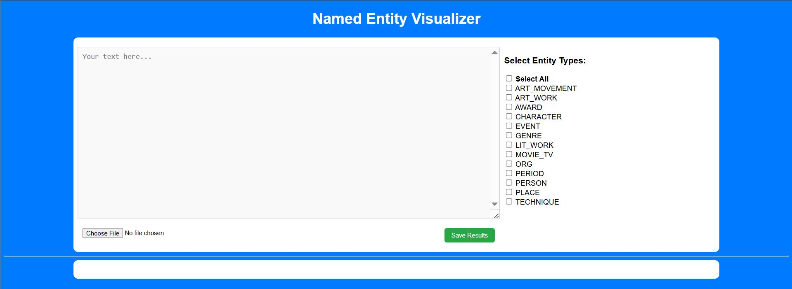
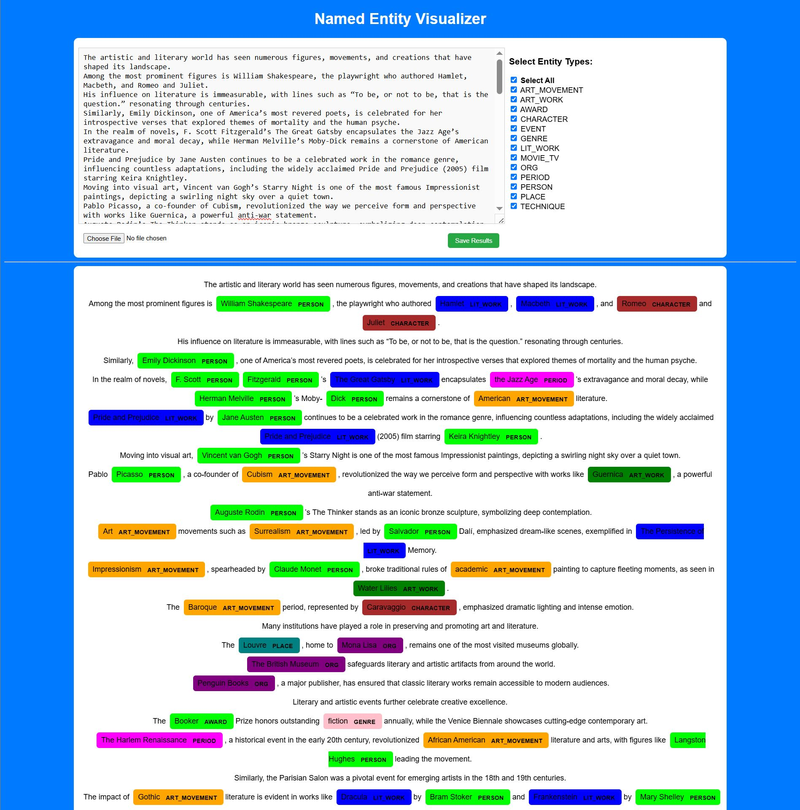
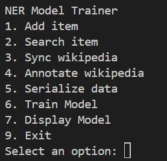
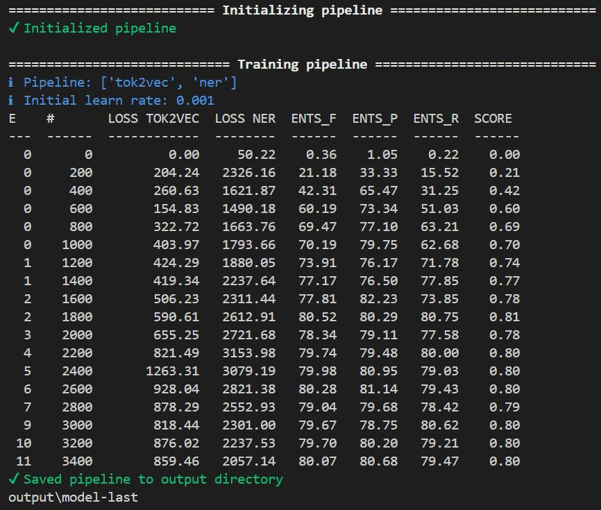

# CIS4930-NER-Model-Project

## Project Overview

This project demonstrates the development of a custom Named Entity Recognition (NER) model using spaCy, tailored for the arts and literature domain, and a Flask-based web application to visualize entity tagging in user-provided text or uploaded documents (PDF/DOCX). 

## Objectives

- **Design & Train a Domain-Specific NER Model**: Build a spaCy model capable of recognizing entities such as authors, literary works, artworks, genres, and more.
- **Develop a Web Interface**: Create a Flask app that allows users to paste text or upload DOCX/PDF files, apply NER, filter by entity type, and download annotated results.
- **Handle Document I/O**: Implement robust extraction from PDFs (using PyMuPDF) and DOCX (using python‑docx), and save highlighted output back into a Word document.
- **Visualize Entity Tags**: Leverage spaCy’s `displaCy` visualizer with customized colors to clearly distinguish entity categories.

## Key Features

- **Custom Entity Set**: 14 tailored entity types including PERSON, LIT\_WORK, ART\_WORK, ART\_MOVEMENT, ORG, PLACE, EVENT, GENRE, CHARACTER, QUOTE, AWARD, PERIOD, TECHNIQUE, and MOVIE\_TV.
- **Interactive Filtering**: Toggle entity categories on and off via checkboxes to focus on specific types.
- **File Upload & Download**:
  - Upload PDF/DOCX -> extract and display raw text.
  - Annotate and download results as a formatted DOCX with colored, bolded entity runs.
- **Annotation Tools**: Scripts for dictionary-based annotation (`annotator.py`) and Wikipedia-based entity dictionary syncing (`main.py`).

## Technology Stack

- **Language & Framework**: Python 3.8+, Flask for web server.
- **NLP**:
  - **spaCy**: Training (`spacy.training`) and inference pipeline.
  - **displaCy**: In-browser entity visualization.
  - **NLTK**: Sentence tokenization and stopword filtering.
- **Document Processing**:
  - **PyMuPDF (fitz)**: PDF text extraction.
  - **python‑docx**: Read/write DOCX files with styled runs.
- **Data Sources & Utilities**:
  - **Wikipedia API**: Automated fetching of entity contexts.
  - **BeautifulSoup**: HTML parsing for ancillary scraping.
  - **datasets**: Loading/serializing training splits.
- **Supporting Tools**: JSON for annotations, regex for normalization, `DocBin` for spaCy binary data.

## Skills & Competencies Demonstrated

- **Machine Learning / NLP**: Data annotation, model serialization, training custom NER with spaCy’s `config.cfg`, evaluating entity performance.
- **Software Engineering**:
  - End‑to‑end pipeline design: collecting, annotating, training, deploying.
  - Modular code organization across training, annotation, and visualization scripts.
- **Web Development**:
  - Building RESTful endpoints (`/filter`, `/upload`, `/save`) and templating with Jinja2.
  - Client‑side interaction with AJAX to dynamically update `displaCy` output.
- **Data Processing**:
  - Complex text normalization, Unicode handling, and regex-driven entity detection.
  - Managing file I/O and binary streams securely and efficiently.

## Demo

### Visualizer App

### Entity Tagging Example

### Model Trainer

### Training Example

